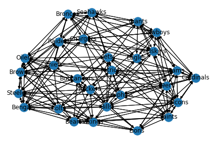

[](https://epsn.readthedocs.io/en/latest/?badge=latest)

# Extraction of Particular Sports as Networks (EPSN)
<p align="center">
	
</p>


**EPSN** is the first ever transformation tool to convert sports data from tabular or unstrucuted format into a network style format like `.gml`. As well as collecting sports data as networks, you only need to provide the desired details and **EPSN** will do the rest.

## Problem
When using network data formats like `.gml` or a `.csv` that explicitly states what the source and target nodes are, there is no room for customization and variability. Often times, finding the right network data is hard, time consuming, and sometimes impossible. This is where **EPSN** comes into play.

## Solution
**EPSN** allows for users to completely customize their querying experience for extracting any sports information at the player or team level. Want to establish a network of MLB players from the 1971 season to see how players interactions led the Pirates to a World Series? You can! Want to analyze all NFL team games in the 21st century for studying effects of losses or wins? Great! You can do that to. The possibilities are endless!

## Currently Supports
| :white_check_mark: NFL  | :white_check_mark: MLB  | :white_check_mark: NHL  | :white_check_mark: NCAAF  | :white_check_mark:/:x: NCAAB  | :x: NBA |
| --- | --- | --- | --- | --- | --- |

---

## Sample Response
Say you would like to query the 1980 NFL season for all games at the team level. The response would be as follows:
```gml
graph[
	multigraph 1
	node[
	 id "Buffalo Bills"
	 label "Bills"
	]
	node[
	 id "Miami Dolphins"
	 label "Dolphins"
	]
	...
	edge[
	 source "Miami Dolphins"
	 target "Buffalo Bills"
	 source_win 1
	 target_win 0
	 week 1
	 year 1980
	 season_type "Reg"
	]
	edge[
	 source "Tampa Bay Buccaneers"
	 target "Cincinnati Bengals"
	 source_win 0
	 target_win 1
	 week 1
	 year 1980
	 season_type "Reg"
	]
    ...
]
```
and the network will look as follows
<p align="center">
  
</p>

## Time for response
The following displays the estimated times of how fast the data is queried and responded

|Level	|NFL   	|MLB 	|NHL 	| NCAAF | NCAAB 	|
|-------|-------|-------|-------|-------|-------	|
|Team   |9s		|20s    |15s    |17s 	|1 min      |
|Player |30 mins|50 mins|30 mins|53 mins|       	|

Obviously, the times are different per yer since the number of teams and players varies per year. This estimates are run for the year 2021 so one could estimate that, for older seasons, the response will be quicker. In essence, the response table above represents the "max". Due to how the system cache's the nodes, the initial time of running is not correct. Overtime, the complexity will shift from $\mathcal{O}(n^3) \rightarrow \mathcal{O}(n^2)$ for the player level due to the previously mentioned system.

## Known Conflicts
Since this package is built on top of another package as a wrapper, if an error develops from the source rather than this wrapper, there is nothing that can be done. This is why, at the time of writing this on 4/21/2022, NBA is not implemented and the player level for NCAAB is not implemented due to these conflicts. I apologize in advance as I know this can be frustrating. The eventual goal is to either seperate from Sportsipy all together or somehow merge. But, this will most likely not be until further down the road for this project to mature properly.

# Documentation
The documentation for this project can be found [here](https://epsn.readthedocs.io/en/latest/) and will be updated routinely to reflect the modules. 
